# Images from the task
## list all accounts
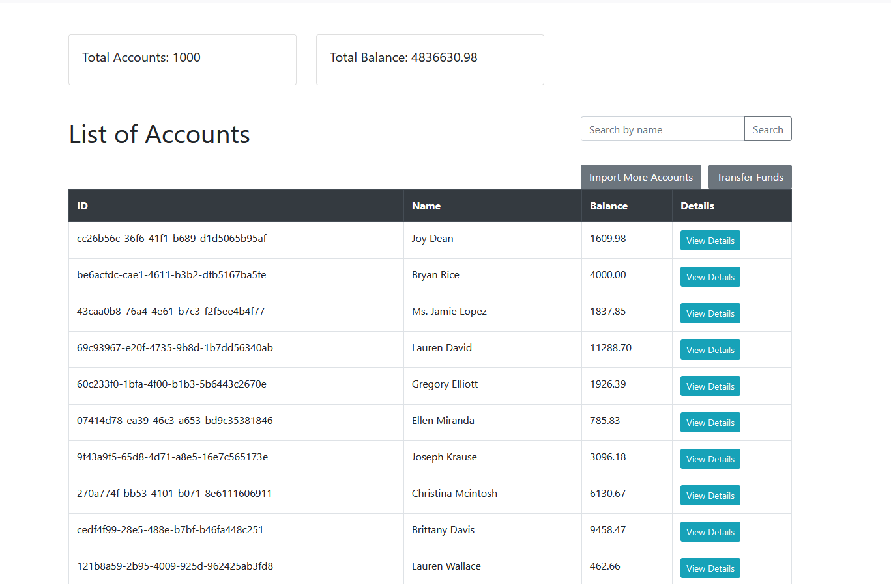
## transfer 
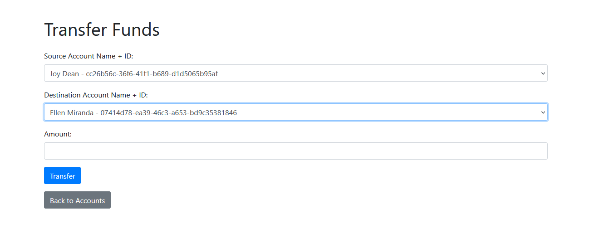
## view account details
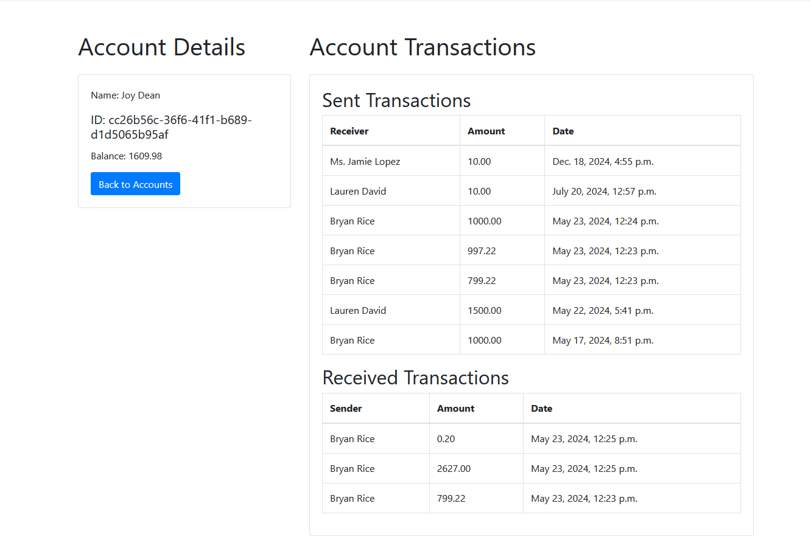
## import from excel sheet
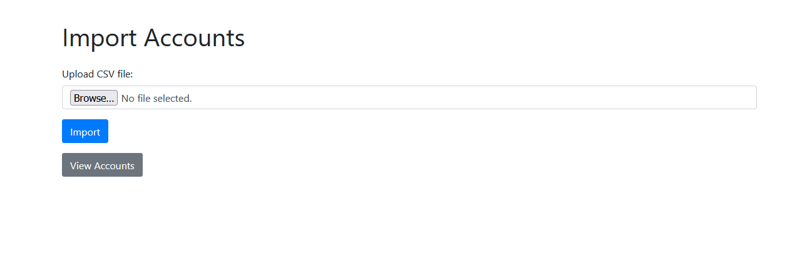
## import more than one file formate
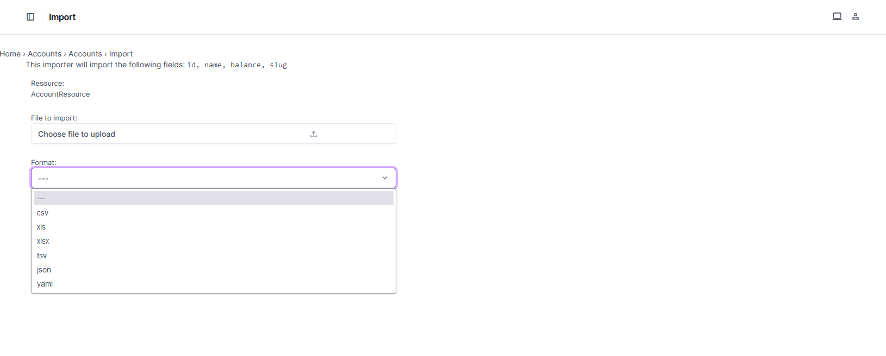
## dashboard
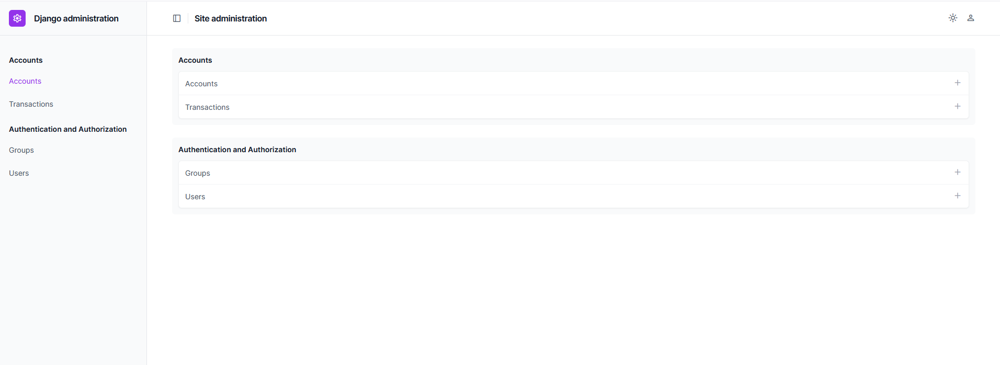
## list transactions
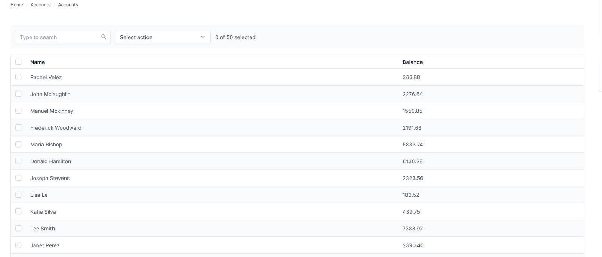
## list accounts
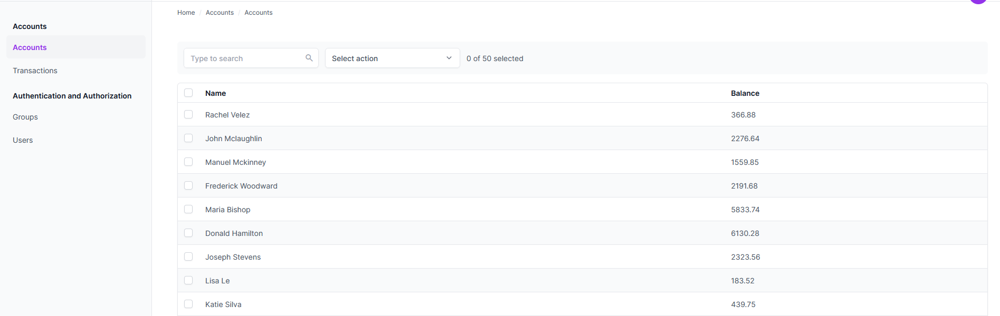
## accounts details with his transactions send and recieve
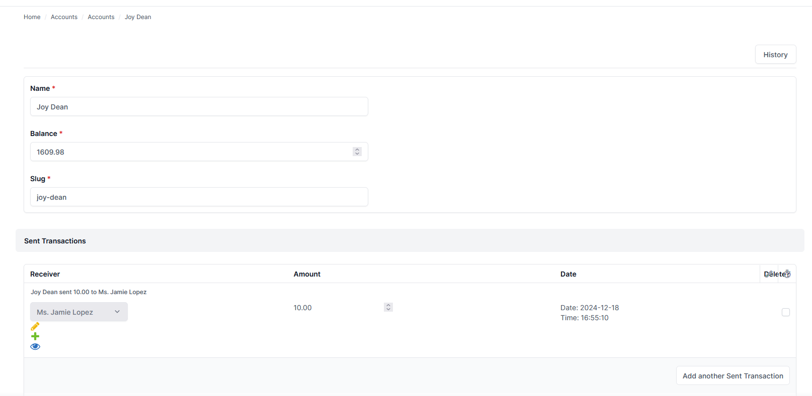
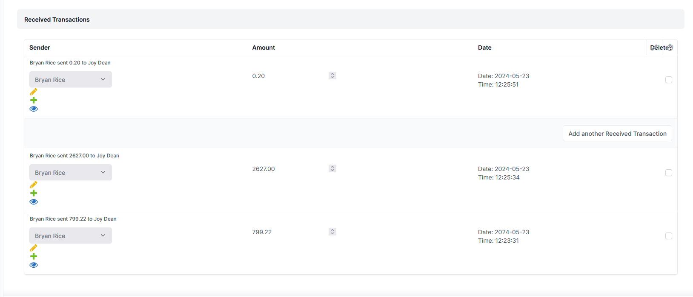
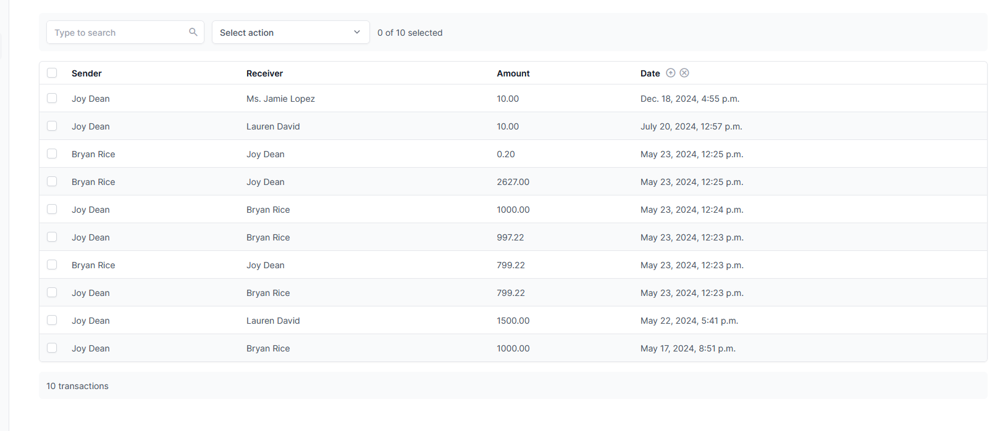


steps to run the project on windows 
1. clone the project
```
git clone https://github.com/EngAhmedElBayoumi/Transaction.git
```
2. go inside the project 
```
cd transaction_task
```
3. create virtualenv
```
python -m venv env
```
4. activate virtualenv
```
env\Scripts\activate
```
5. install requirements
```
pip install -r requirements.txt
```
6. migrate db
```
py manage.py migrate
```
7. runserver
```
py manage.py runserver
```


